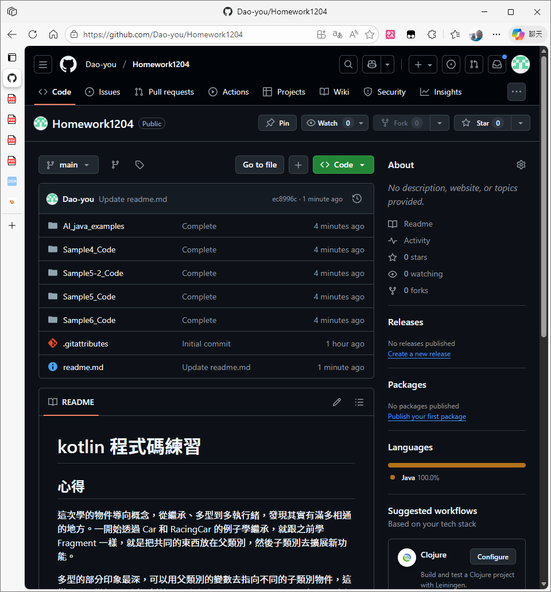

# kotlin 程式碼練習

## 心得

這次學的物件導向概念，從繼承、多型到多執行緒，發現其實有滿多相通的地方。一開始透過 Car 和 RacingCar 的例子學繼承，就跟之前學 Fragment 一樣，就是把共同的東西放在父類別，然後子類別去擴展新功能。

多型的部分印象最深，可以用父類別的變數去指向不同的子類別物件，這樣程式碼變得更靈活。例外處理也有意思，不只是 try-catch，還可以自訂例外類別，加上 synchronized 處理多執行緒的同步化問題。

雖然程式越來越複雜，但只要掌握好這些基本概念，就能寫出更有效率的程式碼。

## Github

### 網址：
[https://github.com/Dao-you/Homework1204](https://github.com/Dao-you/Homework1204)

### 截圖：

# 讀書會

* 組員：方宇澤
* 討論時間：2025/12/03 19:00 ~ 20:00
* 地點：LINE 通話
* 討論主題：Java 類別技巧與問題討論、複習 Android XML 設計工具、討論期末專題方向

